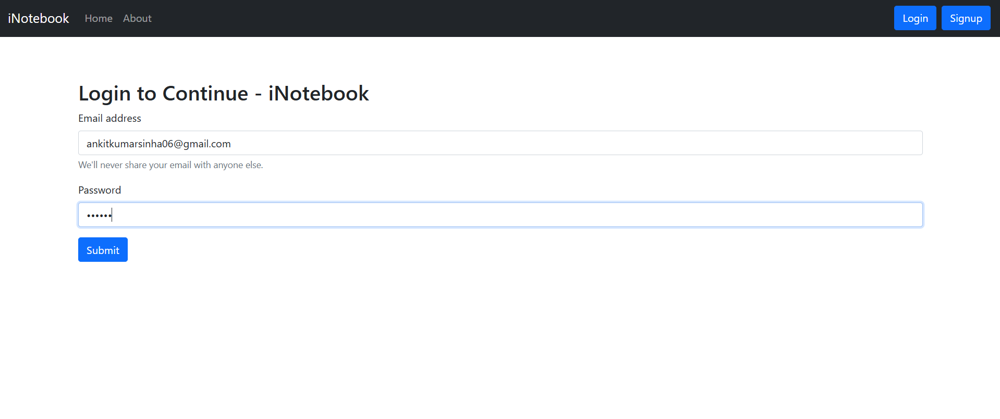
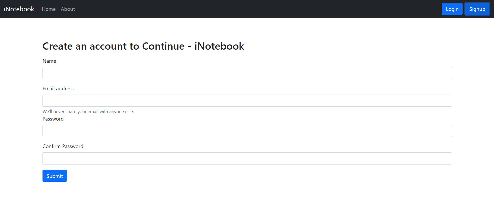
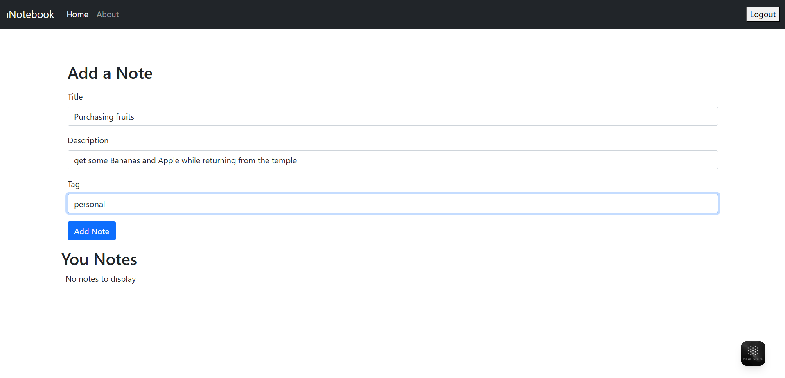
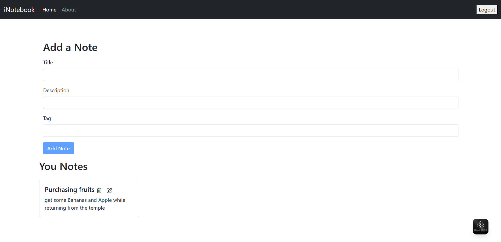
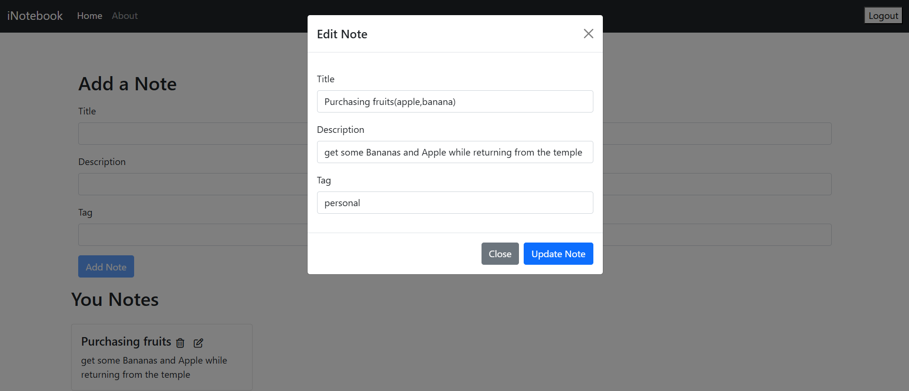

# iNotebook - Your Notes in the Cloud

### 🔻 Login UI  

### 🔻 Signup UI 

### 🔻 Adding A Notes 

### 🔻 Fetching A Notes 

### 🔻 Updating A Notes


---

## Table of Contents

- [About iNotebook](#about-inotebook)
- [Features](#features)
- [Technologies Used](#technologies-used)
- [Prerequisites](#prerequisites)
- [Getting Started](#getting-started)
  - [Backend Setup](#backend-setup)
  - [Frontend Setup](#frontend-setup)
- [Running the Application](#running-the-application)
- [API Endpoints](#api-endpoints)
- [Folder Structure](#folder-structure)
- [Contributing](#contributing)
- [License](#license)

---

## About iNotebook

iNotebook is a full-stack web application designed to help users securely manage their personal notes. With iNotebook, you can create, view, edit, and delete your notes from anywhere, knowing that your data is stored safely in the cloud. The application emphasizes secure user authentication and a seamless user experience.

---

## Features

-   **User Authentication:** Secure signup and login functionality using JWT (JSON Web Tokens).
-   **Notes Management:**
    -   **Create:** Add new notes with a title, description, and optional tag.
    -   **Read:** View all your personal notes.
    -   **Update:** Edit existing notes.
    -   **Delete:** Remove notes you no longer need.
-   **Personalized Experience:** Each user sees only their own notes.
-   **Alerts:** User-friendly alert messages for actions (e.g., successful login, note added/deleted).
-   **Responsive Design:** (Assuming Bootstrap handles this well)
-   **Cloud Storage:** Notes are persistently stored in a MongoDB database.

---

## Technologies Used

**Frontend:**
-   **React.js:** A JavaScript library for building user interfaces.
-   **React Router DOM:** For declarative routing in React applications.
-   **React Context API:** For state management across components.
-   **Bootstrap 5:** For responsive and modern UI components.
-   **Font Awesome:** For icons.
-   **Concurrently:** To run multiple commands simultaneously (frontend and backend development servers).

**Backend:**
-   **Node.js:** JavaScript runtime environment.
-   **Express.js:** A fast, unopinionated, minimalist web framework for Node.js.
-   **MongoDB:** A NoSQL database for storing application data.
-   **Mongoose:** An ODM (Object Data Modeling) library for MongoDB and Node.js.
-   **JSON Web Token (JWT):** For secure user authentication.
-   **Bcrypt.js:** For hashing passwords.
-   **Express Validator:** For request body validation.
-   **CORS:** Middleware to enable Cross-Origin Resource Sharing.
-   **Nodemon:** For automatic server restarts during development.

---

## Prerequisites

Before you begin, ensure you have the following installed on your system:

-   **Node.js** (LTS version recommended)
-   **npm** (Node Package Manager, comes with Node.js) or **Yarn**
-   **MongoDB:** A running instance of MongoDB (locally or cloud-hosted like MongoDB Atlas). If running locally, ensure `mongod` is running.

---

## Getting Started

Follow these instructions to get a copy of the project up and running on your local machine.

### Backend Setup

1.  **Navigate to the `backend` directory:**
    ```bash
    cd iNotebook/backend
    ```
2.  **Install dependencies:**
    ```bash
    npm install
    # or if you use yarn
    yarn install
    ```
3.  **Configure MongoDB:**
    -   Ensure your MongoDB server is running.
    -   Open `db.js` and verify the `mongoURI` connection string. If your MongoDB isn't on `localhost:27017`, update it accordingly.
        ```javascript
        const mongoURI = "mongodb://localhost:27017/inotebook?readPreference=primary&appname=MongoDB%20Compass&directConnection=true&ssl=false"
        ```
    -   **Important:** In a production environment, you should use environment variables for your `mongoURI` and `JWT_SECRET` (currently hardcoded in `routes/auth.js` and `middleware/fetchuser.js`).

### Frontend Setup

1.  **Navigate to the project root (where `App.js` is, outside the `backend` folder):**
    ```bash
    cd iNotebook
    ```
    *(Assuming your frontend is directly in the `iNotebook` root alongside the `backend` folder)*
2.  **Install dependencies:**
    ```bash
    npm install
    # or if you use yarn
    yarn install
    ```

---

## Running the Application

1.  **Start the Backend Server:**
    Open a new terminal window, navigate to the `backend` directory, and run:
    ```bash
    cd iNotebook/backend
    nodemon .\index.js

    ```
    You should see `iNotebook backend listening at http://localhost:5000` in your console.

2.  **Start the Frontend Development Server:**
    Open another new terminal window, navigate to the `iNotebook` root directory (where your `App.js` and `package.json` for frontend are), and run:
    ```bash
    cd iNotebook
    npm start
    # or
    yarn start
    ```
    This will open the iNotebook application in your default web browser, usually at `http://localhost:3000`.

    (3. Running Both Simultaneously (Recommended for Development):
    
        Thanks to the concurrently package and the both script defined in your package.json, you can start both the frontend and backend with a single command from the project root (iNotebook).
    
        From the iNotebook root directory, run:
    
        Bash
    
        npm run both
        # or if you use yarn
        yarn both
        This command will execute npm start (for the React frontend) and nodemon backend/index.js (for the Node.js backend) concurrently in a single terminal window.)

---

## API Endpoints

The backend exposes the following API endpoints:

**Authentication (`/api/auth`)**
-   `POST /api/auth/createuser`: Register a new user. (No login required)
    -   **Body:** `name`, `email`, `password`
-   `POST /api/auth/login`: Log in an existing user. (No login required)
    -   **Body:** `email`, `password`
-   `POST /api/auth/getuser`: Get details of the logged-in user. (Login required - `auth-token` in header)

**Notes Management (`/api/notes`)**
-   `GET /api/notes/fetchallnotes`: Retrieve all notes for the authenticated user. (Login required)
-   `POST /api/notes/addnote`: Add a new note. (Login required)
    -   **Body:** `title`, `description`, `tag` (optional)
-   `PUT /api/notes/updatenote/:id`: Update an existing note. (Login required)
    -   **Params:** `id` (Note ID)
    -   **Body:** `title`, `description`, `tag` (optional, for fields to update)
-   `DELETE /api/notes/deletenote/:id`: Delete a note. (Login required)
    -   **Params:** `id` (Note ID)

---

## Folder Structure

iNotebook/
├── backend/
│   ├── db.js
│   ├── index.js
│   ├── models/
│   │   ├── Note.js
│   │   └── User.js
│   ├── middleware/
│   │   └── fetchuser.js
│   └── routes/
│       ├── auth.js
│       └── notes.js
├── public/
│   ├── favicon.ico
│   ├── index.html
│   └── ... (other public assets)
├── src/
│   ├── App.css
│   ├── App.js
│   ├── index.css
│   ├── index.js
│   ├── components/
│   │   ├── About.js
│   │   ├── AddNote.js
│   │   ├── Alert.js
│   │   ├── Home.js
│   │   ├── Login.js
│   │   ├── Navbar.js
│   │   ├── Noteitem.js
│   │   ├── Notes.js
│   │   ├── Signup.js
│   │   └── ...
│   └── context/
│       └── notes/
│           ├── noteContext.js
│           └── NoteState.js
├── .gitignore
├── package.json
├── package-lock.json
└── README.md

---

## Contributing

Feel free to fork this repository, create a branch, and submit pull requests. Any contributions are welcome!

---

## License

This project is licensed under the MIT License - see the LICENSE.md file for details.
*(You'll need to create a `LICENSE.md` file in your root directory if you want to include this. A simple MIT license file is very common.)*
